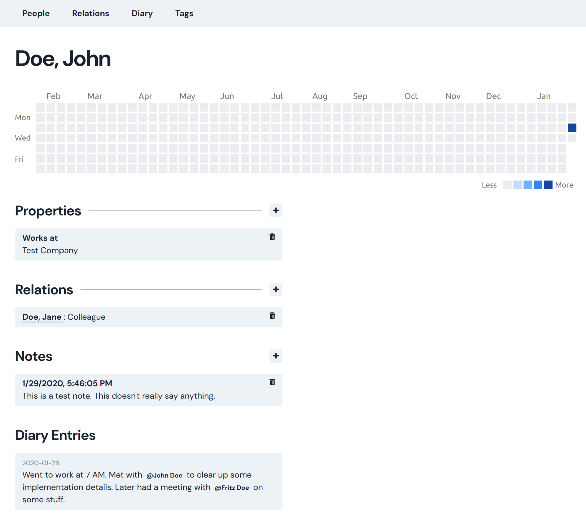

## What?

Keep track of what you're doing and the people in your life.

## State

Early alpha. Base structures are more or less done. See "Next" for next steps.

## Features

### Organize people and relations

Create people and add properties and relations between them. Write down notes on a person.

### Write a journal and tag people in it

Write something down about your day and with whom you interacted. View all entries of the last year which include a specific person on the person's overview page (see above).

### Track habits

Add tags to your diary entries. There's an overview page per tag, which lets you see on which days you used a specific tag throughout the last year.

### Other things

Search for stuff like people, tags and diary entries.

## Next

* Yearly calendar: Date-based properties
* Per property: overview page (e.g. page of all phone numbers)
* Editable relationship graph
* Previous/next buttons when viewing a diary entry

## Develop and use

Download

```bash
git clone https://github.com/jens-ox/prm
cd prm
```

Install dependencies
```bash
cd prm/api
yarn
cd prm/ui
yarn
```

Run API
```bash
cd prm/api
yarn serve
```

Run UI
```bash
cd prm/ui
yarn serve
```
